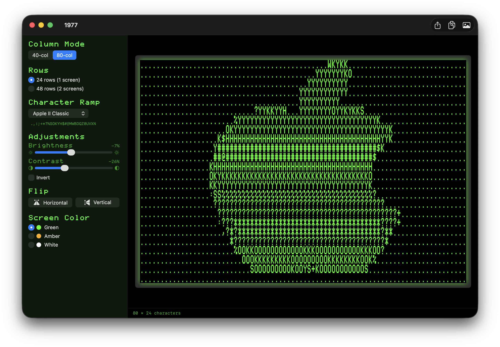
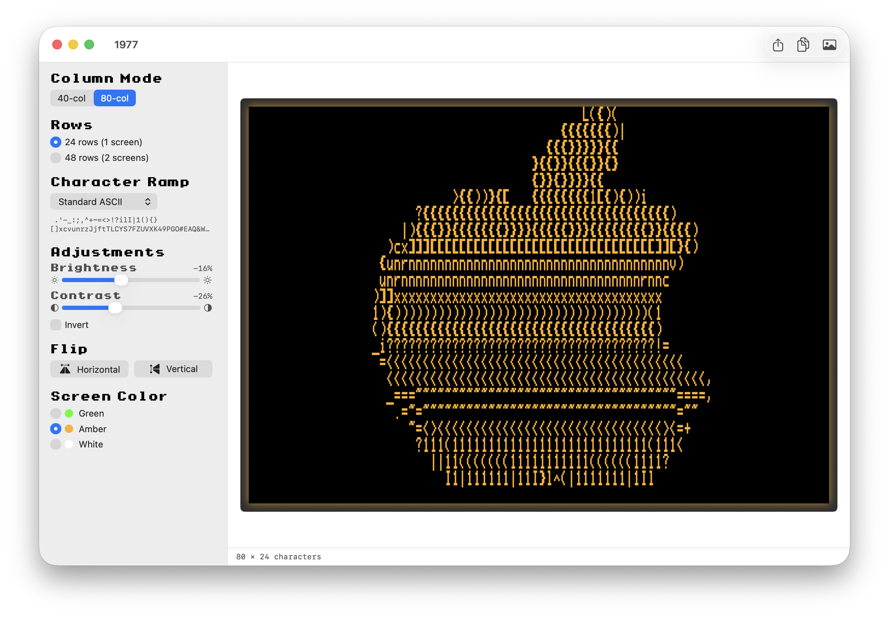
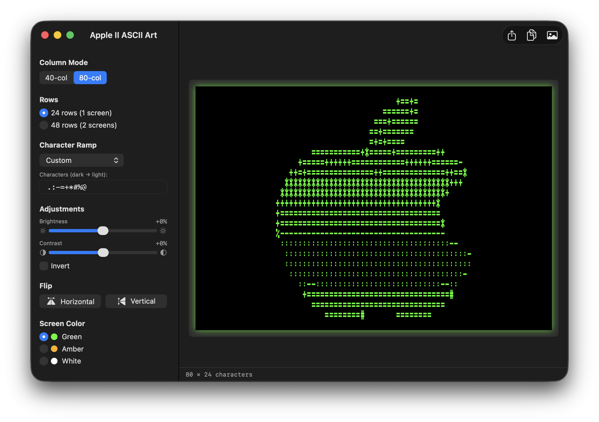
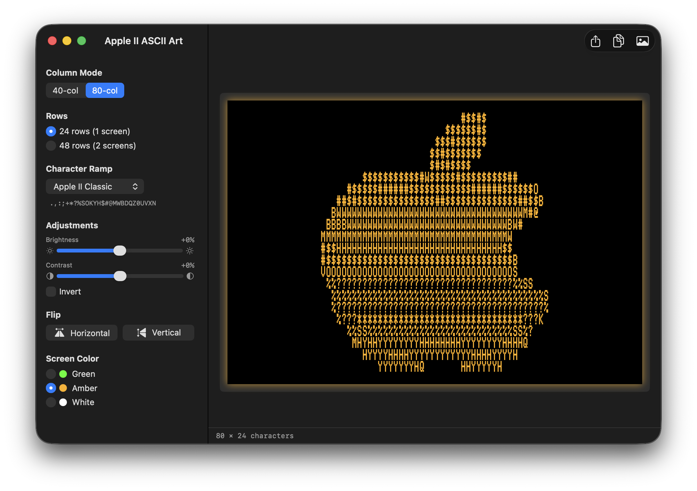
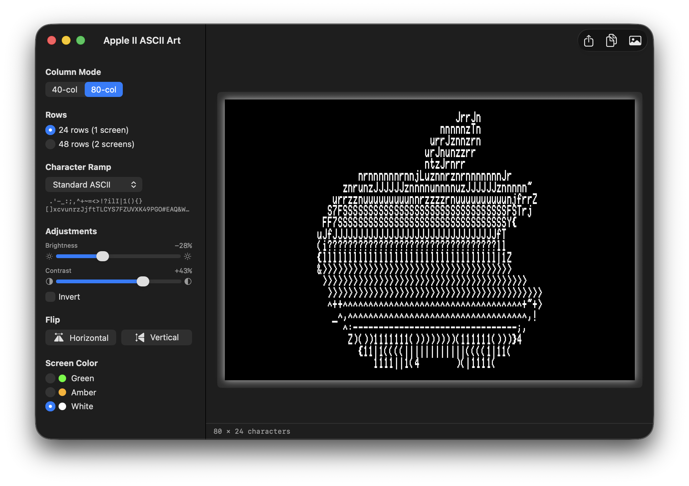
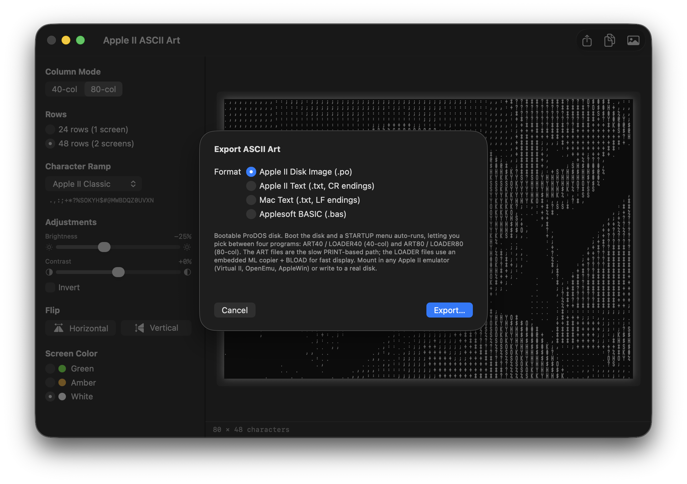
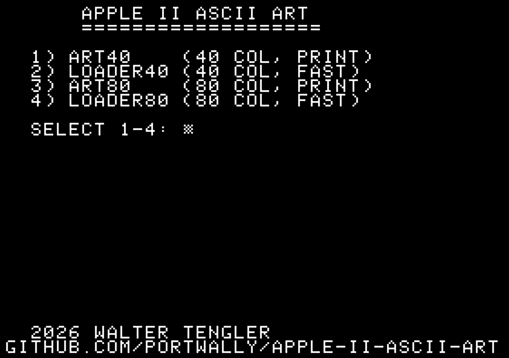

# 1977

> The year the Apple II shipped.

A native macOS app that converts any image into Apple II ASCII art — in **40-column** or **80-column** text mode — and previews it on screen the way it would look on a real Apple II, using authentic period fonts and a phosphor-glow display.

Output can be saved as a bootable ProDOS disk image, plain text ready to `TYPE` on a real Apple II, or a runnable Applesoft BASIC program.

## Screenshots

| Apple II UI theme · Green phosphor · Apple II Classic ramp | Apple IIgs UI theme · Amber phosphor · Standard ASCII ramp |
| :---: | :---: |
|  |  |

## Screen colors

Three classic phosphor looks — green, amber, and white.

| Green (custom ramp) | Amber (Apple II Classic ramp) | White (Standard ASCII ramp, inverted) |
| :---: | :---: | :---: |
|  |  |  |

## Features

- **40-col and 80-col modes** — uses [PrintChar21](https://www.kreativekorp.com/software/fonts/apple2/) for 40-col and [PRNumber3](https://www.kreativekorp.com/software/fonts/apple2/) for 80-col, both bundled inside the app.
- **24 or 48 rows** — one screen, or two screens of scrollable output.
- **Four character ramps + custom** — Apple II Classic, Standard ASCII, Simple, Dense, plus a free-form custom ramp.
- **Brightness, contrast, and invert** with live preview.
- **Horizontal and vertical flip.**
- **Phosphor preview** — green (#33FF00), amber (#FFB000), or white, with subtle screen glow.
- **Aspect-ratio-correct sampling** — input images are mapped onto the Apple II's 280 × 192 display space using BT.709 perceptual luminance, so the output looks right when displayed on real hardware.
- **Drag-and-drop import** for PNG, JPEG, TIFF, GIF, BMP, HEIC.
- **Export formats:**
  - **Apple II Disk Image** (`.po`) — bootable ProDOS disk with a STARTUP launcher and both 40-col and 80-col renderings. Mount in any Apple II emulator (Virtual II, OpenEmu, AppleWin) or write to a real floppy.
  - **Apple II Text** (`.txt`, 7-bit ASCII, CR / `0x0D` line endings) — drop onto a ProDOS disk and `TYPE` it.
  - **Mac Text** (`.txt`, LF endings) — for editing on the Mac.
  - **Applesoft BASIC** (`.bas`, `PRINT` program) — auto-inserts `PR# 3` for 80-column output.

## Export options

<p align="center">
  
</p>

## Disk creation

Picking **Apple II Disk Image** writes a bootable ProDOS volume containing six programs and a STARTUP launcher. Boot it on real hardware or any Apple II emulator and you'll land on this menu:

<p align="center">
  
</p>

Each disk carries:

- **ART40 / ART80** — slow `PRINT`-based programs (one statement per row) you can `LIST` and read.
- **LOADER40 / LOADER80** — fast versions: a small embedded 6502 ML routine `BLOAD`s the screen-memory dump straight to text page 1 and (for 80-col) bank-switches into AUX RAM via `PAGE2`.
- **ART40.BIN / ART80.BIN** — raw screen-memory dumps the loaders BLOAD.
- **STARTUP** — auto-runs at boot, shows the picker, smart-RUNs the chosen program with `PRINT CHR$(4);"-FILENAME"`.

## Requirements

- macOS 14 (Sonoma) or later
- Xcode 16 or later

## Build & run

```sh
git clone https://github.com/portwally/1977.git
cd 1977
open AppleIIASCIIArt.xcodeproj
```

Then press ⌘R in Xcode.

Or build from the command line:

```sh
xcodebuild -project AppleIIASCIIArt.xcodeproj -scheme AppleIIASCIIArt -configuration Release build
```

## How it works

1. The source image is aspect-fill scaled into the Apple II's 280 × 192 display canvas, then downsampled to a `cols × rows` bitmap (one pixel per character cell).
2. Per-cell brightness is computed via BT.709 luminance (`0.2126 R + 0.7152 G + 0.0722 B`) after applying brightness/contrast adjustments.
3. The 0.0 → 1.0 brightness value indexes into the chosen character ramp (dark → light).
4. The grid is rendered live with the appropriate Apple II font on a black phosphor screen, with optional flips and inversion.

## Fonts

Bundled fonts are from [Kreative Korporation](https://www.kreativekorp.com/software/fonts/apple2/):

- **Print Char 21** — the standard Apple II 40-column character set
- **PR Number 3** — the 80-column card character set (`PR# 3`)

## License

Code: see repository. Fonts retain their original Kreative Korporation licenses.
