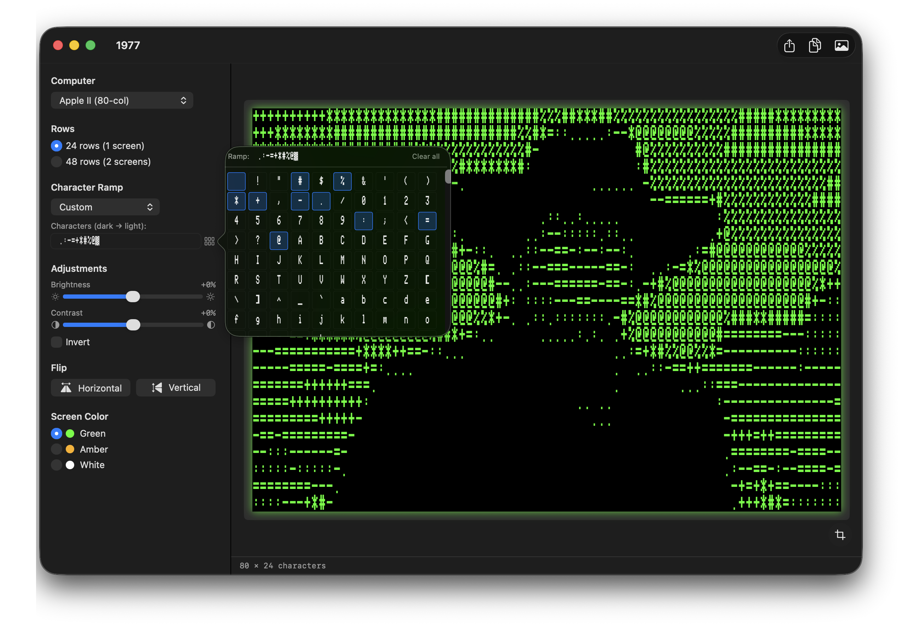
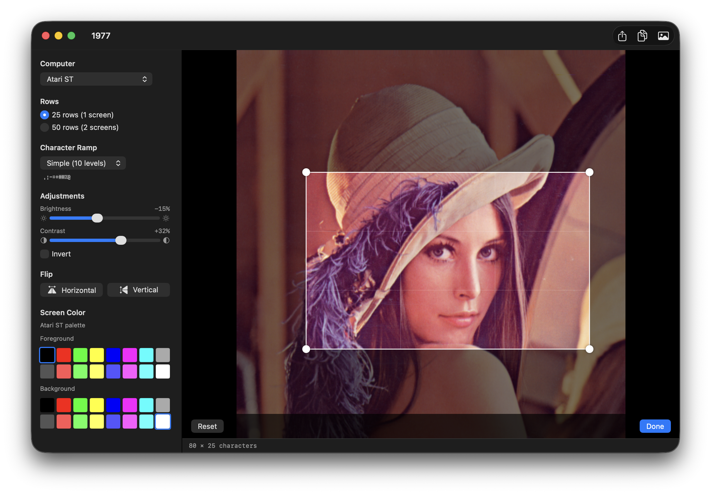
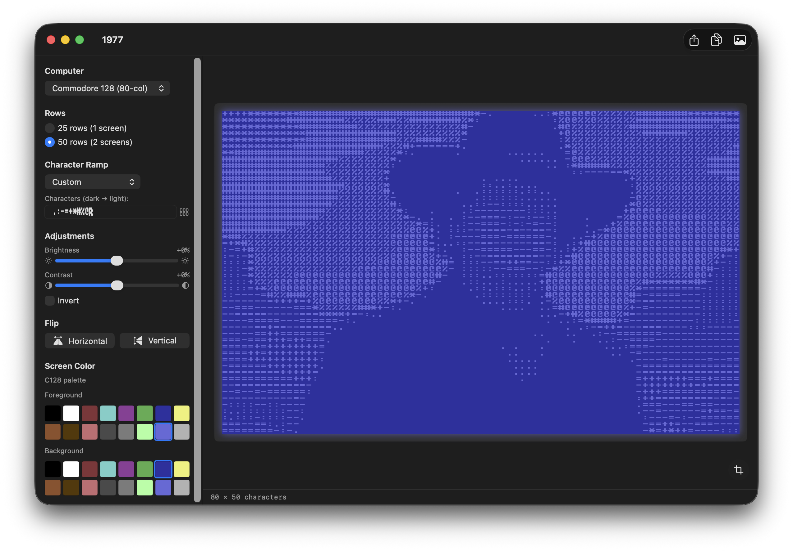
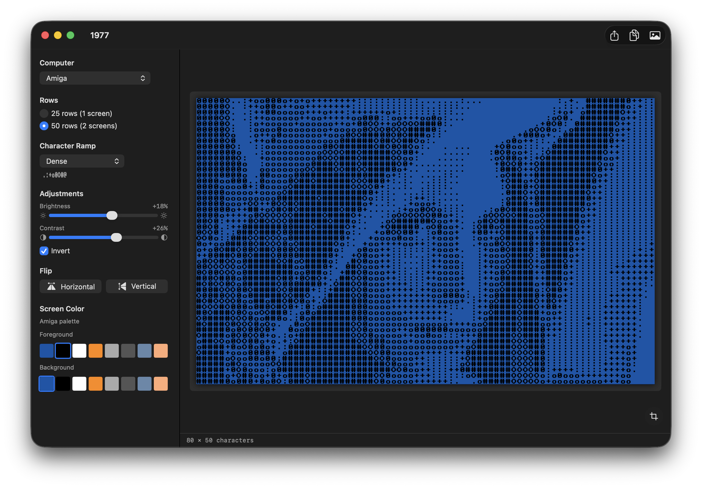
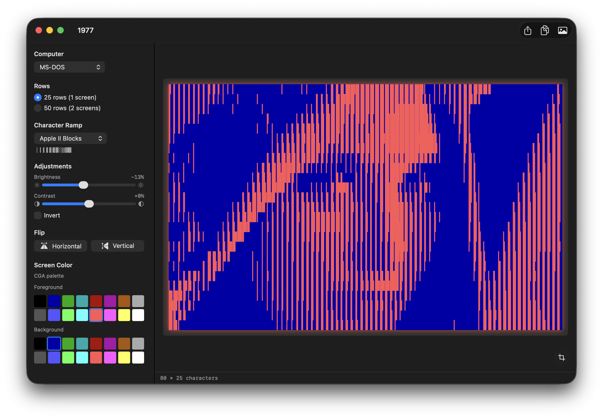
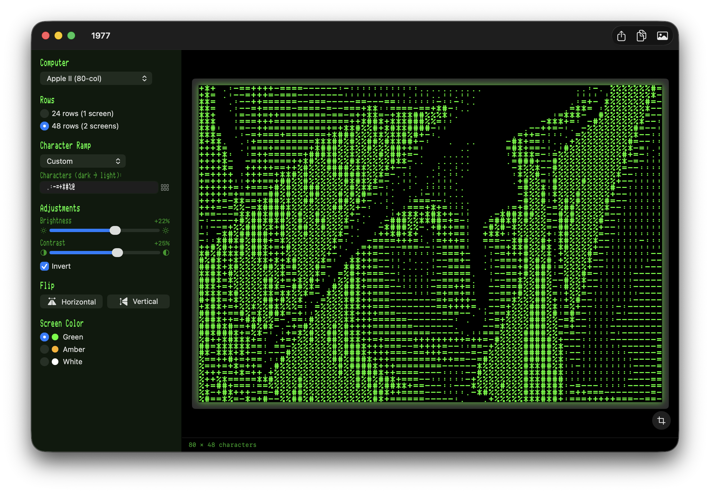
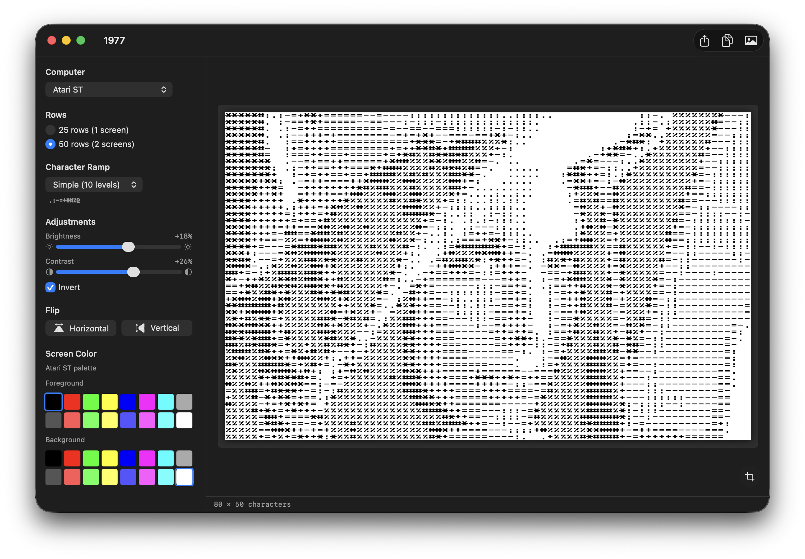
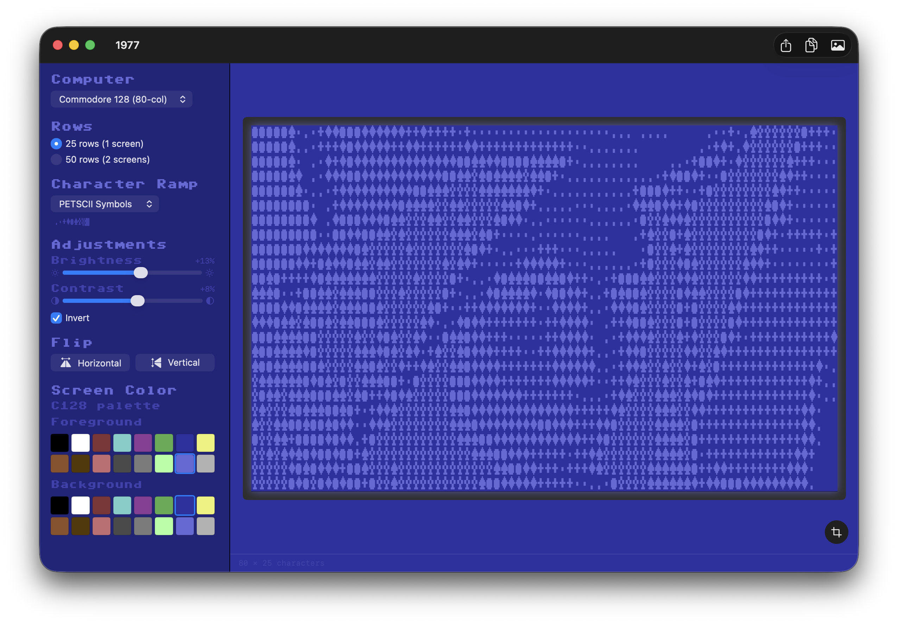

# 1977

> The year the Apple II shipped.

A native macOS app that converts any image into authentic text-mode ASCII art for ten classic platforms — from the Apple II to the Amiga — with live previews using each system's real fonts, hardware palettes, and screen aspect.

Output can be saved as a PNG, a bootable ProDOS disk image, plain text ready to `TYPE` on a real Apple II, or a runnable Applesoft BASIC program.

## Supported platforms

| Platform | Grid | Font |
| --- | --- | --- |
| Apple II (40-col) | 40 × 24 | Print Char 21 |
| Apple II (80-col) | 80 × 24 | PR Number 3 |
| Commodore PET | 40 × 25 | Pet Me 64 |
| Commodore 64 | 40 × 25 | Pet Me 64 |
| Commodore 128 (80-col) | 80 × 25 | Pet Me 128 2Y |
| VIC-20 | 22 × 23 | Pet Me 2X |
| Atari 8-bit | 40 × 24 | EightBit Atari |
| Atari ST | 80 × 25 | Atari ST 8x16 |
| ZX Spectrum | 32 × 24 | ZX Spectrum |
| Amiga | 80 × 25 | Amiga Topaz |
| MS-DOS (CGA) | 80 × 25 | Perfect DOS VGA 437 |

Each platform draws on its native screen aspect ratio (e.g. 280 × 192 for Apple II, 320 × 200 for Commodore, 640 × 400 for Amiga / Atari ST / MS-DOS) and its own colour model — phosphor for monochrome systems, hardware palette for the rest.

## Screenshots

| Apple II 80-col · character picker popover | Atari ST · live crop tool |
| :---: | :---: |
|  |  |

| Commodore 128 (80-col) · custom ramp | Amiga · Workbench palette · Dense ramp |
| :---: | :---: |
|  |  |

| MS-DOS · CGA palette · Apple II Blocks ramp | Apple II 80-col · 48 rows (2 screens) |
| :---: | :---: |
|  |  |

| Atari ST · inverted Simple ramp | Commodore 128 · C64 retro UI theme |
| :---: | :---: |
|  |  |

## Features

- **Ten retro platforms** with native fonts, palettes, and aspect ratios.
- **One screen or two** — native row count, or 2× for double-screen output.
- **Character ramps** — Apple II Classic, Standard ASCII, Simple, Dense, PETSCII Blocks, PETSCII Symbols, CP437 Blocks, plus a custom ramp.
- **Character picker popover** — every glyph in the platform's font in a scrollable grid; click to build your custom ramp.
- **Live crop tool** — draggable, resizable selection box with locked aspect ratio, rule-of-thirds grid, pinch-zoom, two-finger pan, and mouse-wheel zoom.
- **Per-platform colour memory** — phosphor systems get a green / amber / white radio, palette systems get full FG/BG swatch pickers (16 colours for C64/C128/VIC-20/CGA/Atari, 8 for Spectrum/Amiga). Your last selection per platform is remembered.
- **Brightness, contrast, invert** with live preview (debounced 150 ms).
- **Horizontal and vertical flip.**
- **Aspect-ratio-correct sampling** — input images are mapped onto each platform's display canvas using BT.709 perceptual luminance.
- **Drag-and-drop import** for PNG, JPEG, TIFF, GIF, BMP, HEIC.
- **Export formats:**
  - **PNG** at 1×, 2×, or 4× the platform's native resolution.
  - **Apple II Disk Image** (`.po`) — bootable ProDOS disk with a STARTUP launcher and both 40-col and 80-col renderings.
  - **Apple II Text** (`.txt`, 7-bit ASCII, CR / `0x0D` line endings) — drop onto a ProDOS disk and `TYPE` it.
  - **Mac Text** (`.txt`, LF endings) — for editing on the Mac.
  - **Applesoft BASIC** (`.bas`, `PRINT` program) — auto-inserts `PR# 3` for 80-column output.

## Export options

<p align="center">
  
</p>

## Apple II disk creation

Picking **Apple II Disk Image** writes a bootable ProDOS volume containing six programs and a STARTUP launcher. Boot it on real hardware or any Apple II emulator and you'll land on this menu:

<p align="center">
  
</p>

Each disk carries:

- **ART40 / ART80** — slow `PRINT`-based programs (one statement per row) you can `LIST` and read.
- **LOADER40 / LOADER80** — fast versions: a small embedded 6502 ML routine `BLOAD`s the screen-memory dump straight to text page 1 and (for 80-col) bank-switches into AUX RAM via `PAGE2`.
- **ART40.BIN / ART80.BIN** — raw screen-memory dumps the loaders BLOAD.
- **STARTUP** — auto-runs at boot, shows the picker, smart-RUNs the chosen program with `PRINT CHR$(4);"-FILENAME"`.

## Requirements

- macOS 14 (Sonoma) or later
- Xcode 16 or later

## Build & run

```sh
git clone https://github.com/portwally/1977.git
cd 1977
open AppleIIASCIIArt.xcodeproj
```

Then press ⌘R in Xcode.

Or build from the command line:

```sh
xcodebuild -project AppleIIASCIIArt.xcodeproj -scheme AppleIIASCIIArt -configuration Release build
```

## How it works

1. The source image is cropped to the selection rect (or the largest centred AR-matched rect if you haven't moved it), then aspect-fill scaled into the chosen platform's display canvas.
2. The canvas is downsampled to a `cols × rows` bitmap — one pixel per character cell.
3. Per-cell brightness is computed via BT.709 luminance (`0.2126 R + 0.7152 G + 0.0722 B`) after applying brightness/contrast adjustments.
4. The 0.0 → 1.0 brightness value indexes into the chosen character ramp (dark → light).
5. The grid is rendered live in the platform's font, at the platform's foreground / background colour, with optional flips and inversion.

## Fonts

Bundled retro fonts:

- **Print Char 21**, **PR Number 3** — Apple II / IIgs by [Kreative Korporation](https://www.kreativekorp.com/software/fonts/apple2/)
- **Pet Me 64**, **Pet Me 2X**, **Pet Me 128 2Y** — Commodore PET / 64 / 128 / VIC-20 by [Style](https://style64.org/petme)
- **Perfect DOS VGA 437** — by [Zeh Fernando](https://int10h.org)
- **EightBit Atari** — Atari 8-bit
- **ZX Spectrum** — by [Damien Guard](https://damieng.com/typography/zx-origins/)
- **Amiga Topaz** — Commodore Amiga
- **Atari ST 8x16 System Font** — Atari ST

Each font retains its original license; see in-app About / Credits for details.

## License

Code: see repository. Fonts retain their original licenses.
